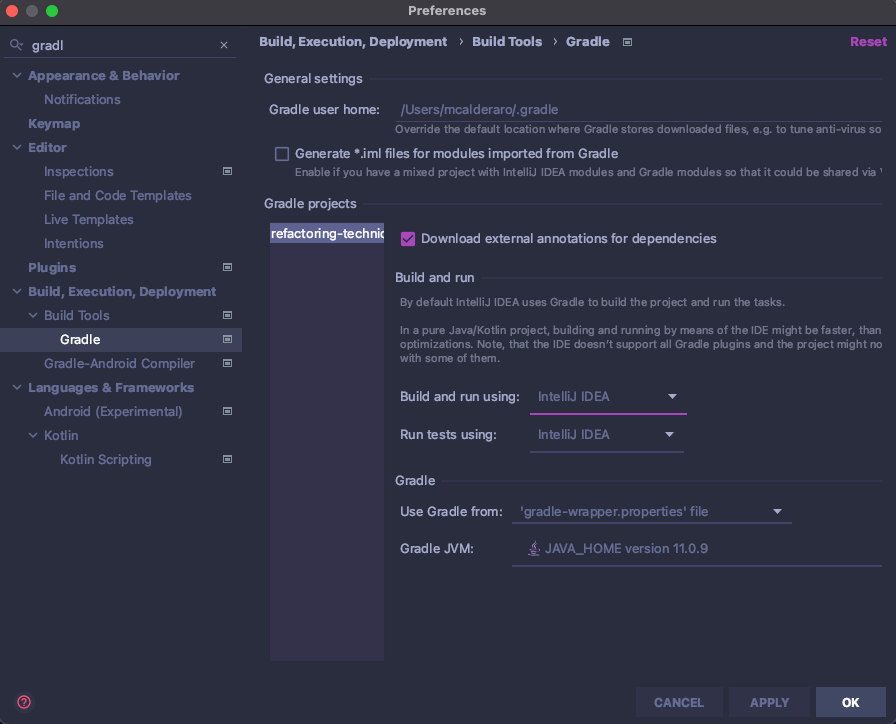

# Introducing JOI Energy

JOI Energy is a new start-up in the energy industry. Rather than selling energy they want to differentiate themselves
from the market by recording their customers' energy usage from their smart meters and recommending the best supplier to
meet their needs.

Currently JOI energy supports reading and recording customer usages. 

## Requirements

The project requires [Java 1.8](http://www.oracle.com/technetwork/java/javase/downloads/jdk8-downloads-2133151.html) or
higher.

The project makes use of Gradle and uses
the [Gradle wrapper](https://docs.gradle.org/current/userguide/gradle_wrapper.html), which means you don't need Gradle
installed.

## Useful Gradle commands

The project makes use of Gradle and uses the Gradle wrapper to help you out carrying some common tasks such as building
the project or running it.

### List all Gradle tasks

List all the tasks that Gradle can do, such as `build` and `test`.

```console
$ ./gradlew tasks
```

### Build the project

Compiles the project, runs the test and then creates an executable JAR file

```console
$ ./gradlew build
```

Run the application using Java and the executable JAR file produced by the Gradle `build` task. The application will be
listening to port `8080`.

```console
$ java -jar build/libs/joi-energy.jar
```

### Run the tests

There are two types of tests, the unit tests and the functional tests. These can be executed as follows.

- Run unit tests only

  ```console
  $ ./gradlew test
  ```

- Run functional tests only

  ```console
  $ ./gradlew functionalTest
  ```

- Run both unit and functional tests

  ```console
  $ ./gradlew check
  ```

### Run the application

Run the application which will be listening on port `8080`.

```console
$ ./gradlew bootRun
```

## Troubleshooting 
- If you have issues with Gradle make sure to setup SDK for the project:
```
Go to File → Project Structure
```


- If you have issue running tests with intellij:
```
Go to IntelliJ → Preferences and search for Gradle under Build Tools
```


## API

Below is a list of API endpoints with their respective input and output. Please note that the application needs to be
running for the following endpoints to work. For more information about how to run the application, please refer
to [run the application](#run-the-application) section above.

### Store Readings

Endpoint

```text
POST /readings/store
```

Example of body

```json
{
  "smartMeterId": <smartMeterId>,
  "electricityReadings": [
    {
      "time": <time>,
      "reading": <reading>
    }
  ]
}
```

Parameters

| Parameter      | Description                                           |
| -------------- | ----------------------------------------------------- |
| `smartMeterId` | One of the smart meters' id listed above              |
| `time`         | The date/time (as epoch) when the _reading_ was taken |
| `reading`      | The consumption in `kW` at the _time_ of the reading  |

Example readings

| Date (`GMT`)      | Epoch timestamp | Reading (`kW`) |
| ----------------- | --------------: | -------------: |
| `2020-11-29 8:00` |      1606636800 |         0.0503 |
| `2020-11-29 8:01` |      1606636860 |         0.0621 |
| `2020-11-29 8:02` |      1606636920 |         0.0222 |
| `2020-11-29 8:03` |      1606636980 |         0.0423 |
| `2020-11-29 8:04` |      1606637040 |         0.0191 |

In the above example, the smart meter sampled readings, in `kW`, every minute. Note that the reading is in `kW` and
not `kWH`, which means that each reading represents the consumption at the reading time. If no power is being consumed
at the time of reading, then the reading value will be `0`. Given that `0` may introduce new challenges, we can assume
that there is always some consumption, and we will never have a `0` reading value. These readings are then sent by the
smart meter to the application using REST. There is a service in the application that calculates the `kWH` from these
readings.

The following POST request, is an example request using CURL, sends the readings shown in the table above.

```console
$ curl \
  -X POST \
  -H "Content-Type: application/json" \
  "http://localhost:8080/readings/store" \
  -d '{"smartMeterId":"smart-meter-0","electricityReadings":[{"time":1606636800,"reading":0.0503},{"time":1606636860,"reading":0.0621},{"time":1606636920,"reading":0.0222},{"time":1606636980,"reading":0.0423},{"time":1606637040,"reading":0.0191}]}'
```

The above command does not return anything.

### Get Stored Readings

Endpoint

```text
GET /readings/read/<smartMeterId>
```

Parameters

| Parameter      | Description                              |
| -------------- | ---------------------------------------- |
| `smartMeterId` | One of the smart meters' id listed above |

Retrieving readings using CURL

```console
$ curl "http://localhost:8080/readings/read/smart-meter-0"
```

Example output

```json
[
  {
    "time": "2020-11-29T08:00:00Z",
    "reading": 0.0503
  },
  {
    "time": "2020-11-29T08:01:00Z",
    "reading": 0.0621
  },
  {
    "time": "2020-11-29T08:02:00Z",
    "reading": 0.0222
  },
  {
    "time": "2020-11-29T08:03:00Z",
    "reading": 0.0423
  },
  {
    "time": "2020-11-29T08:04:00Z",
    "reading": 0.0191
  }
]
```

### View Current Price Plan and Compare Usage Cost Against all Price Plans

Endpoint

```text
GET /price-plans/compare-all/<smartMeterId>
```

Parameters

| Parameter      | Description                              |
| -------------- | ---------------------------------------- |
| `smartMeterId` | One of the smart meters' id listed above |

Retrieving readings using CURL

```console
$ curl "http://localhost:8080/price-plans/compare-all/smart-meter-0"
```

Example output

```json
{
  "pricePlanComparisons": {
    "price-plan-2": 0.0002,
    "price-plan-1": 0.0004,
    "price-plan-0": 0.002
  },
  "pricePlanId": "price-plan-0"
}
```

### View Recommended Price Plans for Usage

Endpoint

```text
GET /price-plans/recommend/<smartMeterId>[?limit=<limit>]
```

Parameters

| Parameter      | Description                                          |
| -------------- | ---------------------------------------------------- |
| `smartMeterId` | One of the smart meters' id listed above             |
| `limit`        | (Optional) limit the number of plans to be displayed |

Retrieving readings using CURL

```console
$ curl "http://localhost:8080/price-plans/recommend/smart-meter-0?limit=2"
```

Example output

```json
[
  {
    "price-plan-2": 0.0002
  },
  {
    "price-plan-1": 0.0004
  }
]
```
